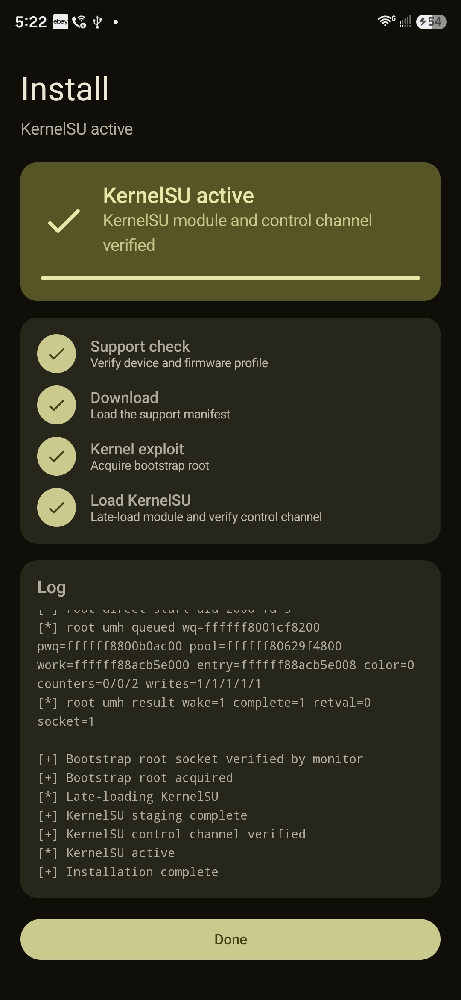
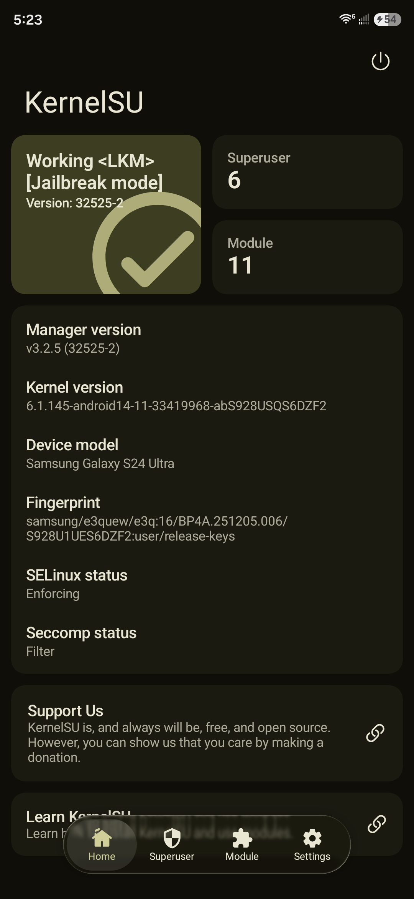
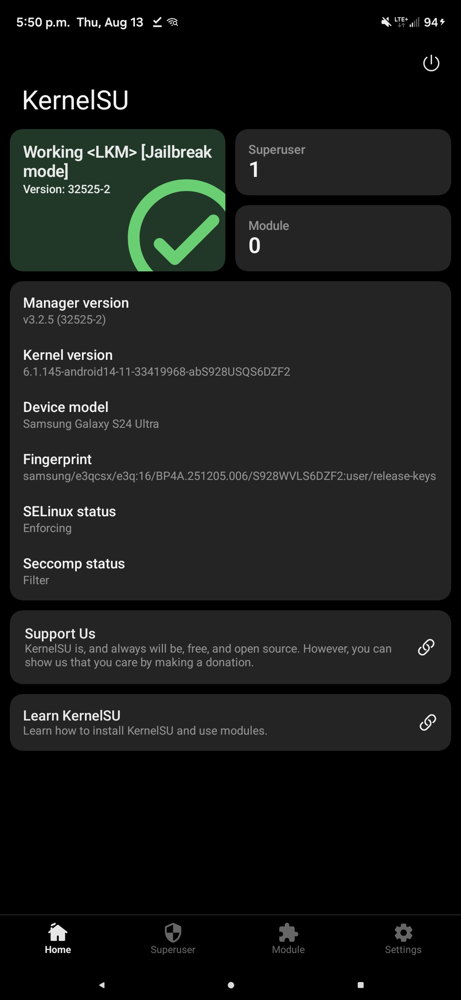
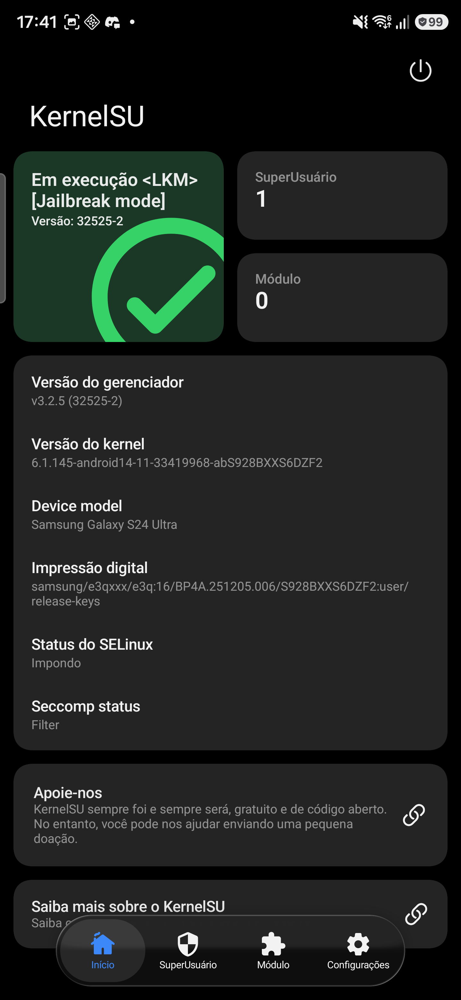

# Root My Galaxy SM-S928U

Porting workspace for Root My Galaxy on the Samsung Galaxy S24 Ultra
`SM-S928U` / `SM-S928U1`, codename `e3q`, firmware `S928U1UES6DZF2`.

This is the device-tested US DZF2 port: exact target headers, P0 fingerprint
table, runtime KASLR recovery, bounded pselect task-bank handling, a
reproducible public-source payload, and the matching KernelSU late-load pair.
The same offline app also ships the related `SM-S928B` and `SM-S928W` DZF2
profiles so those devices can use this pack without waiting on the upstream
payload feed.

This repository keeps the source, Android app, target manifests, KernelSU
reference patches, and helper scripts needed to reproduce the local port.
Use this only on devices you own or are explicitly authorized to test.

## Screenshots

These screenshots show the SM-S928U1 port reaching KernelSU in LKM jailbreak
mode, and the Root My Galaxy app recognizing the target.

<table>
  <tr>
    <td align="center"><strong>Root My Galaxy app</strong></td>
    <td align="center"><strong>KernelSU Manager</strong></td>
  </tr>
  <tr>
    <td align="center">
      
    </td>
    <td align="center">
      
    </td>
  </tr>
</table>

The same offline APK also recognized the later S928W and S928B DZF2 ports:

<table>
  <tr>
    <td align="center"><strong>SM-S928W KernelSU</strong></td>
    <td align="center"><strong>SM-S928B KernelSU</strong></td>
  </tr>
  <tr>
    <td align="center">
      
    </td>
    <td align="center">
      
    </td>
  </tr>
</table>

## Validated Target

This is the port completed and tested in this workspace:

```text
model: SM-S928U1
device: e3q
build display: BP4A.251205.006.S928U1UES6DZF2
fingerprint: samsung/e3quew/e3q:16/BP4A.251205.006/S928U1UES6DZF2:user/release-keys
kernel release: 6.1.145-android14-11-33419968-abS928USQS6DZF2
kernel build: #1 SMP PREEMPT Tue Jun  9 08:23:14 UTC 2026
```

Root My Galaxy reports `KernelSU active`. KernelSU Manager reports
`Working <LKM> [Jailbreak mode]`, version `32525-2`. `su -c id` returns
`uid=0(root) ... context=u:r:ksu:s0`. SELinux stays Enforcing. The method is
per-boot; no boot image is modified.

`SM-S928U` on the same internal kernel `S928USQS6DZF2` uses this same profile.

## What This Port Adds

The original work in this repository is the `e3q-S928USQS6DZF2` profile:

- exact S928U1 DZF2 target header and P0 fingerprint table
- runtime kernel-base recovery and bounded pselect task-bank handling
- reproducible stable app payload
  (`b2931d8980f969b5a0cb05bd67f6804f445ad4a4c867a7b4c4081c2ffac5b36a`)
- exact-vermagic KernelSU v3.2.5 module and device-tested late-load `ksud`
- bundled offline launcher that loads `asset://` payloads instead of GitHub

The S928B and S928W entries reuse that U1 profile as the starting point. They
are kept as separate targets because the firmware-specific values are
different. The U1 payload and `ksud` are not rewritten for those devices.

## Additional DZF2 Profiles

| Model | Firmware | Profile | What changed from the U1 port |
| --- | --- | --- | --- |
| `SM-S928B` | `S928BXXS6DZF2` | `e3q-S928BXXS6DZF2` | Own vermagic and `SLIDE_NFULNL_LOGGER_OFF` `0x016a622a` |
| `SM-S928W` | `S928WVLS6DZF2` | `e3q-S928W-S928USQS6DZF2` | Same US kernel banner as U1, but bucket `28` / one bank slot, and the S928B no-patch-text `ksud` |

```text
model: SM-S928B
device: e3q
build display: BP4A.251205.006.S928BXXS6DZF2
fingerprint: samsung/e3qxxx/e3q:16/BP4A.251205.006/S928BXXS6DZF2:user/release-keys
kernel release: 6.1.145-android14-11-33419968-abS928BXXS6DZF2

model: SM-S928W
device: e3q
product: e3qcsx
build display: BP4A.251205.006.S928WVLS6DZF2
fingerprint: samsung/e3qcsx/e3q:16/BP4A.251205.006/S928WVLS6DZF2:user/release-keys
kernel release: 6.1.145-android14-11-33419968-abS928USQS6DZF2
```

`SM-S928N`, `SM-S9280`, and any non-DZF2 build are rejected.

## Prerequisites

Before running the port, make sure the phone is ready:

1. **Enable Developer options and USB debugging**.
2. **Enable "Disable child process restrictions"** in Developer options
   (wording varies by One UI version; it sits next to the USB debugging
   toggles). Shizuku needs this to spawn the helper processes the port
   relies on.
3. **Install [Shizuku](https://shizuku.rikka.app/).** It performs the
   privileged operations this app needs, without a full root shell.
4. **Reboot the phone.** A clean boot avoids stale permission/service state
   and makes the whole flow work on the first try.
5. **Close every other app and background process.** Keep only Shizuku and
   Root My Galaxy running.
6. **Start the Shizuku service**
7. **Open Root My Galaxy** and grant it permission when Shizuku prompts.

If a previous attempt left a stale file, remove it before retrying:

```sh
adb shell rm -f /data/local/tmp/ksu-payload
```

The script prints the manual ADB test commands at the end. It does not open a
root shell automatically.

## Documentation

- [Documentation Index](docs/README.md): all detailed project docs.
- [Target Profile](docs/TARGET.md): exact device and firmware values expected by this port.
- [Project Structure](docs/PROJECT_STRUCTURE.md): what each directory contains.
- [Reproduce The Port](docs/REPRODUCE_PORT.md): full payload generation flow.
- [Build, Install, And ADB](docs/BUILD_INSTALL_ADB.md): app build, install, staging, and manual test commands.
- [Troubleshooting](docs/TROUBLESHOOTING.md): common failures and how to diagnose them.

Upstream reference material is also kept in:

- [PORTING.md](PORTING.md)
- [PROJECT-MANIFEST.txt](PROJECT-MANIFEST.txt)
- [kernelsu/README.md](kernelsu/README.md)
- [support/README.md](support/README.md)
- [SM-S928U1 record](docs/SM-S928U1-S928U1UES6DZF2.md)
- [SM-S928W record](docs/SM-S928W-S928USQS6DZF2.md)
- [SM-S928B record](docs/SM-S928B-S928BXXS6DZF2.md)

## Quick Start

From the repository root:

```sh
./tools/prepare-s928-dzf2.sh
```

Build the debug APK:

```sh
./tools/prepare-s928-dzf2.sh --build-apk
```

Build, install, and stage local ADB files:

```sh
./tools/prepare-s928-dzf2.sh --all
```

A prebuilt debug APK from this tree is:

```text
dist/RootMyGalaxy-S928-DZF2-offline-v0.3.1.apk
```

## Important Files

```text
tools/prepare-s928-dzf2.sh
app/src/main/assets/targets-v3.json
src/targets/e3q-S928USQS6DZF2/target.h
src/targets/e3q-S928USQS6DZF2/p0_fingerprint.h
artifacts/e3q-S928USQS6DZF2/cve-2026-43499-app.so
kernelsu/ksud-e3q-S928USQS6DZF2-kdp
```

## Credits And Base Repository

This SM-S928U1 DZF2 port is based on
[BuSung-dev/Root-My-Galaxy-Payloads](https://github.com/BuSung-dev/Root-My-Galaxy-Payloads)
and the Root My Galaxy app baseline from
[youyoudezhuzhu/rmg-f731u](https://github.com/youyoudezhuzhu/rmg-f731u).

The offline repository layout, bundled `asset://` app flow, and
reproduction-script structure follow
[soumarcelino/Root-My-Galaxy-SM-S918B](https://github.com/soumarcelino/Root-My-Galaxy-SM-S918B).

The S928U1 target profile, payload, KernelSU pair, and device validation in
this repository are the local port. The S928B profile comes from
[RiosWesley](https://github.com/RiosWesley) in
[Root-My-Galaxy-Payloads#208](https://github.com/BuSung-dev/Root-My-Galaxy-Payloads/pull/208).
The S928W bucket and `ksud` findings come from
[mvfsullivan](https://github.com/mvfsullivan) in
[Root-My-Galaxy-Payloads#216](https://github.com/BuSung-dev/Root-My-Galaxy-Payloads/pull/216);
this tree keeps that work as a separate profile so the tested U1 payload is
not overwritten.

This repository is an adaptation for `SM-S928U` / `SM-S928U1` / `e3q` /
`S928U1UES6DZF2`, plus the related S928B and S928W DZF2 profiles. It is not
the original F731U or SM-S918B target.
