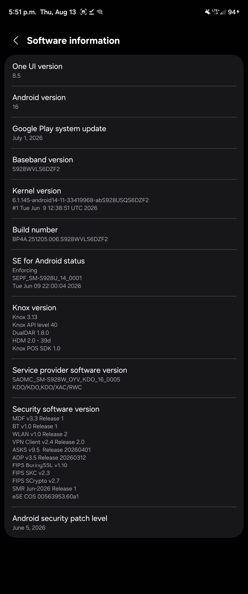

# SM-S928W / S928WVLS6DZF2 porting record

Canadian Galaxy S24 Ultra support from
[BuSung-dev/Root-My-Galaxy-Payloads#216](https://github.com/BuSung-dev/Root-My-Galaxy-Payloads/pull/216)
(`mvfsullivan`, commit `246b2b560bae63917223ab740018af4686ded2a8`).

This pack keeps W as its own profile. It does not rewrite the device-tested
U/U1 payload.

## Device identity

| Field | Value | Source |
| --- | --- | --- |
| Model | `SM-S928W` | PR #216 |
| Device | `e3q` | KernelSU screenshot |
| Product | `e3qcsx` | KernelSU screenshot |
| PDA / build display | `BP4A.251205.006.S928WVLS6DZF2` | Settings screenshot |
| Fingerprint | `samsung/e3qcsx/e3q:16/BP4A.251205.006/S928WVLS6DZF2:user/release-keys` | KernelSU screenshot |
| Kernel release | `6.1.145-android14-11-33419968-abS928USQS6DZF2` | both screenshots |
| Kernel build | `#1 Tue Jun 9 12:38:51 UTC 2026` | Settings screenshot |
| Baseband | `S928WVLS6DZF2` | Settings screenshot |
| CSC | `KDO` | Settings screenshot |

The kernel banner is the US DZF2 string. The user-visible firmware token is
the Canadian `S928WVLS6DZF2` build.

## Why W is not the U/U1 profile

PR #216 recorded two W-only failures against the stock U/U1 pair:

1. SLUB packed 28 `mm_struct` objects. The U/U1 header rejects bucket 28
   (`max=27`). W raises `SLIDE_S928_BANK_LOCK_MAX_BUCKET` to `28` and lowers
   `SLIDE_BANK_SLOTS` from `4` to `1` so the lock bank still fits the
   reclaimed page.
2. `ksud-e3q-S928USQS6DZF2-kdp` live-patches text and panics under KDP/RKP
   on W. The S928B no-patch-text `ksud-e3q-S928BXXS6DZF2-kdp` loaded without
   reboot.

Those two values stay on the W profile only.

## Payload

PR #216 described a rebuilt
`artifacts/e3q-S928USQS6DZF2/cve-2026-43499-app.so`, but the file at
`246b2b5` is still SHA-256
`b2931d8980f969b5a0cb05bd67f6804f445ad4a4c867a7b4c4081c2ffac5b36a`, the
original U/U1 payload.

This pack rebuilt the W header locally:

```sh
ANDROID_NDK_HOME=/home/steve/.local/android-ndk/android-ndk-r29 \
  make TARGET=e3q-S928W-S928USQS6DZF2 API=35 stable
```

```text
artifacts/e3q-S928W-S928USQS6DZF2/cve-2026-43499-app.so
size 104128
SHA-256 82531cb637067d8e849f1c9d259933dcc3bed3519c1603841333cc8bcbd789e0
```

KernelSU late-load uses the already-audited S928B no-patch-text pair:

```text
kernelsu/ksud-e3q-S928BXXS6DZF2-kdp
size 4748232
SHA-256 43f451313dc111429187f8f93e76c57c42976323782aac936c1c09aa309b76b3
```

## Hardware validation

PR #216 reports device success on this exact W build. KernelSU Manager
showed `Working <LKM> [Jailbreak mode]`, version `32525-2`, the US DZF2
kernel release, and fingerprint `.../S928WVLS6DZF2:user/release-keys`.
SELinux remained Enforcing. Root remains per-boot.



